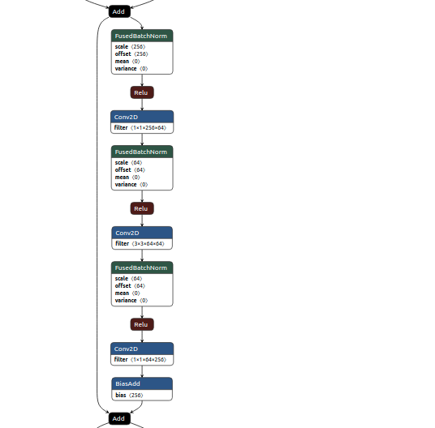

[pytorch code](https://github.com/siam1251/cmds/blob/master/pytorch.md)                    
[basics](https://www.analyticsvidhya.com/blog/2020/04/comprehensive-popular-deep-learning-interview-questions-answers/)   
[pdf](https://github.com/siam1251/cmds/blob/master/ML%20Interview%20Cheat%20sheet.pdf)     
[different activation functions](https://towardsdatascience.com/activation-functions-neural-networks-1cbd9f8d91d6)
another link [activation functions](https://towardsdatascience.com/activation-functions-in-deep-neural-networks-aae2a598f211)       
[avoid overfitting (variance)](https://machinelearningmastery.com/introduction-to-regularization-to-reduce-overfitting-and-improve-generalization-error/)  
[Different loss function](https://medium.com/@zeeshanmulla/cost-activation-loss-function-neural-network-deep-learning-what-are-these-91167825a4de) and [equations](https://ml-cheatsheet.readthedocs.io/en/latest/loss_functions.html#:~:text=Cross%2Dentropy%20loss%2C%20or%20log,diverges%20from%20the%20actual%20label.)      
[Batch, Mini Batch & Stochastic Gradient Descent ](https://towardsdatascience.com/batch-mini-batch-stochastic-gradient-descent-7a62ecba642a#:~:text=Batch%20Gradient%20Descent%20can%20be,converges%20faster%20for%20larger%20datasets.)       
[epoch, batch, iteration](https://towardsdatascience.com/epoch-vs-iterations-vs-batch-size-4dfb9c7ce9c9)    

[ML system](https://www.theinsaneapp.com/2021/03/system-design-and-recommendation-algorithms.html)                  
L1 vs L2 Regularization ?         
```
The main intuitive difference between the L1 and L2 regularization
L1 regularization tries to estimate the median of the data while the 
L2 regularization tries to estimate the mean of the data to avoid overfitting.
```

##### Batch Gradient Descent -> all the examples for every step of Gradient Descent                      
##### Stochastic Gradient Descent -> one example at a time to take a single step     
```
Mini Batch Gradient Descent                                     
      1 Pick a mini-batch                       
      2 Feed it to Neural Network                      
      3 Calculate the mean gradient of the mini-batch                      
      4 Use the mean gradient we calculated in step 3 to update the weights                      
      5 Repeat steps 1–4 for the mini-batches we created      
```
### Regression Loss vs Classification loss [link](https://machinelearningmastery.com/how-to-choose-loss-functions-when-training-deep-learning-neural-networks/)      

Regression Loss Functions     

    * Mean Squared Error Loss         
    * Mean Squared Logarithmic Error Loss         
    * Mean Absolute Error Loss         
Binary Classification Loss Functions     

    * Binary Cross-Entropy         
    * Hinge Loss         
    * Squared Hinge Loss         
Multi-Class Classification Loss Functions      

    * Multi-Class Cross-Entropy Loss         
    * Sparse Multiclass Cross-Entropy Loss         
    * Kullback Leibler Divergence Loss         


#### Batch Gradient Descent            
In Batch Gradient Descent, all the training data is taken into consideration to take a single step. We take the average of the gradients of all the training examples and then use that mean gradient to update our parameters. So that’s just one step of gradient descent in one epoch.

#### gradient vanishing problem [link](https://en.wikipedia.org/wiki/Vanishing_gradient_problem#:~:text=One%20of%20the%20newest%20and,part%20of%20the%20network%20architecture.)         
we use other activation that sigmoid (since the gradient of sigmoind for very high or very low value tends to zero)         
Rectifiers such as ReLU suffer less from the vanishing gradient problem, because they only saturate in one direction         


### ML System design   
[doordash](https://www.youtube.com/watch?v=sEZsIUBIhNk)     

### Resnet Blocks    
```
x->conv2d->batchNorm->activation-------->conv2d->batchnorm->activation +->activation
|                                                                      |
------------------------------------------------------------------------
Relu or any other activation funcion
 ```
 
 
feature-> embeddings
auto-endcoder
