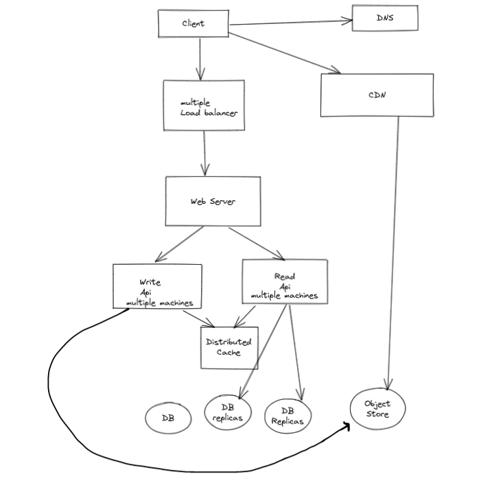
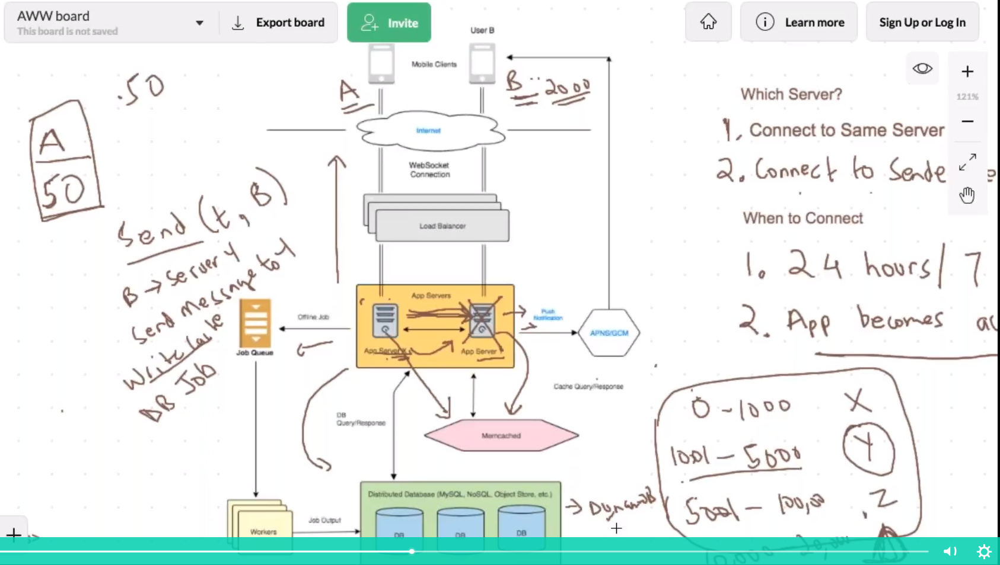
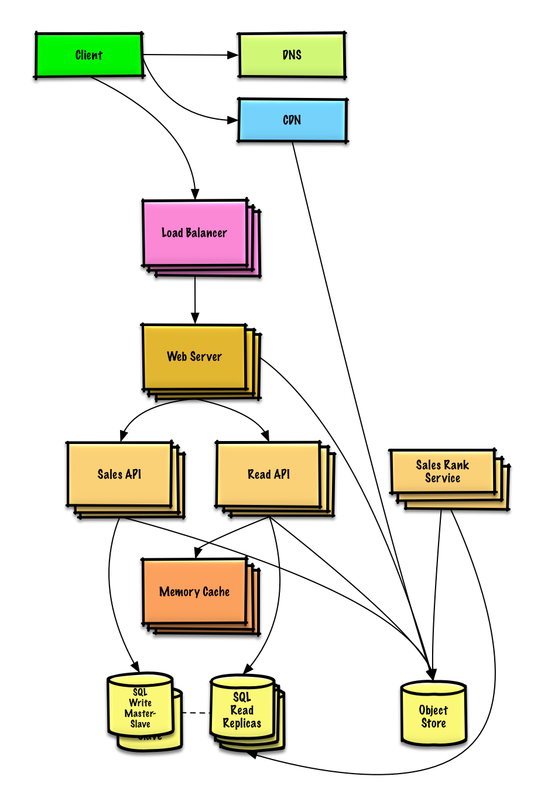

steps:
* capacity estimation, QPS, storage
* CAP theorem
* high level api 
* Caching

idempotent             
[security](#security)      

<a name="security">   
  
### Security   
 TLS handshake [link](https://www.cloudflare.com/en-ca/learning/ssl/what-happens-in-a-tls-handshake/#:~:text=A%20TLS%20handshake%20is%20the,and%20agree%20on%20session%20keys.)

Different no-sql database
|database type| example|
|-------|-----|
|Time series| influxDB, prometheus, graphite|
|graph based|Neo4j|
|spatial|quadtree, R tree|
|blob stroe|amazon s3, gcs|

Availability

|Avialability| Downtime per year|
|-------|-----|
|90%(one nine)|36 days|
|99%(two nine)|3.6 days|
|99.9%(3 nine)|8.7 hours|
|**99.99% ("four nines")**|	52.60 minutes	|
|**99.999% ("five nines")	|5.26 minutes**|
|99.9999% ("six nines")	|31.56 seconds|
|99.99999% ("seven nines")|	3.16 seconds|

### Scaling your design (swiss army knife)
 * sharding
 * cacheing
 * indexing columns
 * CDN
 * Geolocation
 * offloading to job queue-cpu/time intensive
 * prefetching-keep reads sequentially
 * batch your writes
 * Reading/writing from workers, replicas
 * blocking as less as possible-consitency
### Scaling your algorithm 


### There are four conditions that are necessary to achieve deadlock:
* Mutual Exclusion - At least one resource must be held in a non-sharable mode; If any other process requests this resource, then that process must wait for the resource to be released.       
* Hold and Wait - A process must be simultaneously holding at least one resource and waiting for at least one resource that is currently being held by some other process.
* No preemption - Once a process is holding a resource ( i.e. once its request has been granted ), then that resource cannot be taken away from that process until the process voluntarily releases it.
* Circular Wait - A set of processes { P0, P1, P2, . . ., PN } must exist such that every P[ i ] is waiting for P[ ( i + 1 ) % ( N + 1 ) ]. ( Note that this condition implies the hold-and-wait condition, but it is easier to deal with the conditions if the four are considered separately. )

|storage| lookup time|
|-------|-----|
|RAM    |100x faster than disk|
|Reading 1 MB from RAM| 250 μs .25 ms|
|Reading 1 MB from SSD| 1,000 μs (1 ms)|
|Transfer 1 MB over Network| 10,000 μs (10 ms)|
|Reading 1MB from HDD|20,000 μs (20 ms)|
|Inter-Continental Round Trip|150,000 μs (150 ms)|

### Capacity estimation   
youtube
|storage| Reads/sec| Writes/sec|Bandwidth|
|-------|----------|------------|--------|
| 1M users| | ||
| 1M users| | ||
| 1M users| | ||
| 1M users| | ||
| 1M users| | ||

### BASE (nosql database)     
* Basically available
* Soft state
* eventually consistent

[Cassandra and mongoDB & CAP theorem](https://www.ibm.com/cloud/learn/cap-theorem)    
* Cassandra uses masterless architecture (partition in a ring, consistent hashing) and use gossip protocol to communicate 
* 
ACL  (authorized client list)  
[JWT (JSON Web Token) and OpenID Connect (OIDC, based auth2)](https://www.youtube.com/watch?v=ZjPF8yZ83Wo)       
* openID activates authn
  
| Databases | features |consistency|    example       |
| ------ | ------ |-----|------|         
|DynamoDB, amazon| kv store, key–value and document data structures, OLTP (Online Transactional Processing) | typically used as eventually consistent|  The partition key + the optional sort key form the primary key of the table, so they must be unique.  let's say I'm storing logging data for several applications. My partition key could be the Application Name, and the sort key the timestamp of the log. This allows me to query all logs of a particular application of the last hour in 1 query, using the BEGINS WITH operator, or even all the logs of last Wednesday for an application, by using the BETWEEN operator| 
|amazon s3| large object store database, key-value base|--|  |
|cassandra,hbase, big table| wide column store, key-value, use row key, Online analytical processing (OLAP)| typically used as eventually consistent| [hbase](https://hbase.apache.org/book.html#datamodel) has column family then colum name, usually one hfile per column family, row_key, column-family[c1, c2] are sorted based on row_key. searching based on row_key is fast (get operation) [link](https://www.linkedin.com/pulse/secondary-indexing-hbase-tale-how-screw-up-simple-idea-michael-segel/) but with other keys it's slow (scan operation), you may create another  table with another row_key for faster search|
|sql| structured storage, used in any transaction| consistent, ACID| |

* Transaction Model [stack overflow](https://stackoverflow.com/a/29381684)
```
Neither Amazon DynamoDB nor Apache HBase support multi-item/cross-row or crosstable transactions due to performance considerations.
However, both databases provide batch operations for reading and writing 
multiple items/rows across multiple tables with no transaction guarantees.
```
```
For workloads that need high update rates to perform data aggregations or maintain counters, Apache HBase is a good choice.
This is because Apache HBase supports a multi-version concurrency control mechanism, which contributes to its strongly consistent reads and writes.
Amazon DynamoDB gives you the flexibility to specify whether you want your read request to be eventually consistent or strongly
consistent depending on your specific workload. reached within a second.
```
### spark vs hadoop   
Hadoop uses persistent data storage for map/reduce operation while spark use in memory (RDD-resilient distributed datasets)
* spark is super fast (realtime) vs map/reduce was never meant for realtime
* hadoop uses yarn (resource manager), pig, hive, sqoop
* both are fault tolerant 
* For realtime use spark otherwise hadoop 
### CAP theorem       
Consistency: Every read receives the most recent write or an error           
Availability: Every request receives a (non-error) response, without the guarantee that it contains the most recent write            
Partition tolerance: The system continues to operate despite an arbitrary number of messages being dropped (or delayed) by the network between nodes           

http long polling vs web sockets          

[system desing primer](https://github.com/donnemartin/system-design-primer#content-delivery-network)                
[comparison](https://www.prisma.io/dataguide/intro/comparing-database-types)           
[column family vs row](https://dataschool.com/data-modeling-101/row-vs-column-oriented-databases/)                   
[ovserable pattern vs pub-sub pattern](https://medium.com/easyread/difference-between-pub-sub-pattern-and-observable-pattern-d5ae3d81e6ce)           

### What’s the Difference Between Columnar Database (redshift) vs. Wide-column Database (hbase, cassandra)?          
A Columnar data store will store each column separately on disk. A Wide-column database is a type of columnar database that supports a column family stored together on disk, not just a single column.

[kabir vai](https://docs.google.com/document/d/1-Fv2nih7LZ9EJC-E_f_vMvkOsaAiadXWPXP--7EEd-s/edit)       
### Sabir vai links   
http://highscalability.com/amazon-architecture?fbclid=IwAR3oPXtzLW7mVDkHly6sAeGFSOTNb1RN43c8KL3H83XjJ2b459D4TnX5T_U                 
http://highscalability.com/google-architecture?fbclid=IwAR2mT91b27hE7xEug6x5b3KAathp8YQQhEMwmghhBapTnk5kDiJpPwYDhjY              
http://highscalability.com/youtube-architecture?fbclid=IwAR3CGL4dxgtRCmusUiipUZGqgKrFVs1JROJBbwV3xiQYpnEe0x-CTBURiMU                     
http://highscalability.com/blog/2016/6/27/how-facebook-live-streams-to-800000-simultaneous-viewers.html                              
http://highscalability.com/scaling-twitter-making-twitter-10000-percent-faster                             
http://highscalability.com/blog/2014/2/26/the-whatsapp-architecture-facebook-bought-for-19-billion.html                             
http://highscalability.com/blog/2015/9/14/how-uber-scales-their-real-time-market-platform.html
http://highscalability.com/blog/2011/12/19/how-twitter-stores-250-million-tweets-a-day-using-mysql.html
https://instagram-engineering.com/what-powers-instagram-hundreds-of-instances-dozens-of-technologies-adf2e22da2ad
https://www.youtube.com/watch?v=PE4gwstWhmc

##### column family is not column oriented database(hbase is column family where redshift is column oriented, redshift is RDMS database but column oriented)

### Which part I should focus to implement?

### Requirement 
  * What does the system do? (web crawler)
  * I want to make sure that we are at the same page. Can you please give me an example?
  * Which part I should focus to implement?
  * which parts should I implement, newsfeed generation or user posts?
  * Decide whether it's a algorithmic question or system design? If you are still confused ask interviewer.
  * Who are the users of this system? (important!)
  * Will this system server globally? (cluster)
  * what will be the number of users at a time? 5B, dayily 2B, 
  * capacity estimation: Vehicle travel time from source to destination is latency.       
       Types of Roadways are bandwidth.
       Number of Vehicles traveling is throughput.        
       Latency (difference between post and response in seconds)            
  * what many users will post at a second?
  * what will be post size? 100 KByte * 5 Posts * 2B = 1000 Billon KB = 10^9*10^3
  * make your system latency p99.99 ? how?
#### Calculation:
 
  * convert 2B/(24*60*60) per second
  * Data incoming and data outgoint ?
  * characters
  * How many servers do I need, one server can serve 1 Million uses so ....

### Federation (or functional partitioning [link](https://github.com/donnemartin/system-design-primer#reverse-proxy-web-server))          
splits up databases by function. For example, instead of a single, monolithic database, you could have three databases: forums, users, and products, resulting in less read and write traffic to each database and therefore less replication lag
### Database Scaling 
  * sharding or partition
  * sharding is need when lots of write otherwise Replication would work  
  * vertical sharding, many tables, tweet tabe, user table
  * horizontal sharding, tweet table will be sharded into multiple machines
  * horizontal sharding, based on user id (mod id by total number of machines to redirect multiple machines) 
  * replication (no single point of failure)
  
Client  -> Gateway server -> load balancer --> clusters --> database

### Message Brokers / asynchronous communication / (pub/sub pattern)       
   * RabbitMQ (default point to point channel/ but can be configured as pub/sub)
   * Redis
   * Kafka (pub/sub)

### Caching software (CDN for video cache, asset server )           
* Redis (S3 for object or video cache, asset server)  
* Memcache
* Casandra
### apache kafka (data driven architecture)  must visit [link](https://www.youtube.com/watch?v=06iRM1Ghr1k)     
   * kafka topics are same as a database (using ksql)  

### Write-ahead logging         
### Seperating metadata and data         
### Cassandra (low latency circular database)              
### stream api using kafka                     
### lambda architecture uses kafka (for analyzing data) [link](https://www.youtube.com/watch?v=BO761Fj6HH8)           
### kafka messaging (broker/topic)    
### Elasticsearch 
   * Application search —- For applications that rely heavily on a search platform for the access, retrieval, and reporting of data.
   * Website search —- Websites which store a lot of content find Elasticsearch a very useful tool for effective and accurate searches. It’s no surprise that Elasticsearch is steadily gaining ground in the site search domain sphere.
## Terms   

### relational vs nosql [link](https://integrant.com/blog/when-to-use-sql-vs-nosql)  
   #### SQL      
   * Scaling out with SQL is possible, but requires extensive effort (partitioning, sharding, clustering, etc.) and cost. 
   *  You can run SQL on Azure, for example, but you will be limited in your ability to scale.
   *  If you’re working with a multi-tenant application, you will need sharding and partitioning (separating very large databases into smaller, faster, more easily managed parts). To achieve this with SQL databases requires additional coding. NoSQL databases (such as CosmosDB) includes these features out-of-box.
   #### NoSQL  
   *  NoSQL engines are designed to scale out and leverage cloud computing. When scaling out or horizontally we are adding resources to a single node (a computer or server). We can have one database working on multiple nodes. Scaling out (or back in) means we can easily add and remove nodes. This makes NoSQL a perfect match for the cloud. Because it can scale out, you will be maximizing the scalability benefits of the cloud. 
   *  NoSQL vs. SQL Speed (of your team) The ability to store huge amounts of data in a flexible way makes NoSQL faster to develop.
   *
  #### SQL vs NOSQL
| SQL | NOSQL |
| ------ | ------ |
|   Data uses schema     |     Schema-less    |
|   Relations     |    No (very few) relations     |
|   Data is distributed across multiple table and normalized     |     Data is typicall merged/ nested in a few collections, no join operation is needed as data is self sufficient    |
|  Horizontal scaling is difficult/impossible; vertical scaling is possible      |  Both horizontal and vertical scaling is easy to implement       |
|    Limitations for lots of (thousands) read and write queries per second    |     Great performance for mass(simple) read & write |

### Data denormalization    
   * Denormalization is a strategy used on a previously-normalized database to increase performance. [link](https://en.wikipedia.org/wiki/Denormalization)     
### Kafka           
   * [link](https://www.neovasolutions.com/2020/07/20/apache-kafka-a-quick-overview/)
   * kafka clusters
   * zookeaper is used for monitoring kafka clusters 
   * Kafka is used for data streaming (pub/sub pattern)
   
   ```
       producer1 producer2 producer3
        |            |         |
    -----------kafka clusters------------------
       topic1            topic2           topic3
       ------            ------           ------
       partition1       partition1
       partition2       partition2
       partition3
    --------------------------------------------
        |                 |                 |
     consumer1         consumer2        consummer3
   ```
   
### Zookeeper
   * heartbeat to check if other servers are alive
   * Zookeeper replicates all your data to every node and lets clients watch the data for changes. Changes are sent very quickly (within a bounded amount of time) to clients. You can also create "ephemeral nodes", which are deleted within a specified time if a client disconnects.
   * cluster-wide locks for your services  
   * Finally, the maximum size of a "file" (znode) in Zookeeper is 1MB, but typically they'll be single strings.
   * Basically, ZooKeeper (and Curator, which is built on it) helps in handling the mechanics of clustering -- heartbeats, distributing updates/configuration, distributed locks, etc

### Redis [link](https://redis.io/topics/introduction)   
  * Transactions
  * Pub/Sub
  * Lua scripting
  * Keys with a limited time-to-live
  * LRU eviction of keys
  * Automatic failover
### Fanout/Fanin
### NGINX (en·juh-neks)    
Load balancing software  
### Clusters vs bucket
### lazy vs eager
### persistent data storage
### indexing sql table column
### S3 vs GCS (google cloud storage)  
### Load Balancer  
### Microservice   
### Peer to Peer connection  or download for machines in a same cluster  
### HFDS ( Hadoop Distributed File System)
### apache kafka vs apache spark 


  <br/><br/>

   <br/><br/>

   <br/><br/>

  
  
